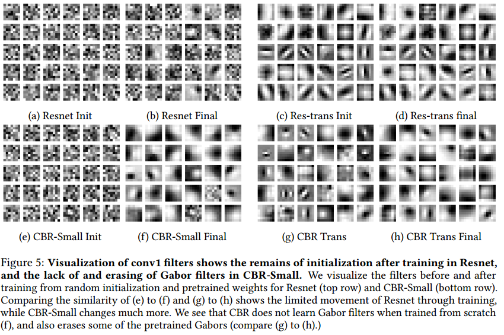
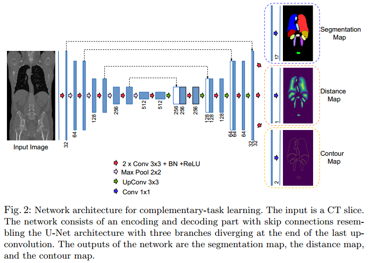

- [Review](#review)
  - [2019](#2019)
    - [Machine Learning Techniques for Biomedical Image Segmentation: An Overview of Technical Aspects and Introduction to State-of-Art Applications](#machine-learning-techniques-for-biomedical-image-segmentation-an-overview-of-technical-aspects-and-introduction-to-state-of-art-applications)
    - [Understanding Deep Learning Techniques for Image Segmentation](#understanding-deep-learning-techniques-for-image-segmentation)
    - [Deep Semantic Segmentation of Natural and Medical Images: A Review](#deep-semantic-segmentation-of-natural-and-medical-images-a-review)
- [Segmentation](#segmentation)
  - [Data Augmentation](#data-augmentation)
    - [K. Abhishek and G. Hamarneh. Mask2Lesion: Mask-Constrained Adversarial Skin Lesion Image Synthesis[C]. Simulation and Synthesis in Medical Imaging, Cham, 2019:71–80.](#k-abhishek-and-g-hamarneh-mask2lesion-mask-constrained-adversarial-skin-lesion-image-synthesisc-simulation-and-synthesis-in-medical-imaging-cham-201971%e2%80%9380)
  - [Transfer learning](#transfer-learning)
    - [Maithra Raghu, Chiyuan Zhang, Jon M. Kleinberg, Samy Bengio. Transfusion: Understanding Transfer Learning for Medical Imaging. NeurIPS 2019: 3342-3352](#maithra-raghu-chiyuan-zhang-jon-m-kleinberg-samy-bengio-transfusion-understanding-transfer-learning-for-medical-imaging-neurips-2019-3342-3352)
  - [Uncertainty Theory and Applications](#uncertainty-theory-and-applications)
    - [A. Jungo and M. Reyes, “Assessing Reliability and Challenges of Uncertainty Estimations for Medical Image Segmentation,” in Medical Image Computing and Computer Assisted Intervention – MICCAI 2019, Cham, 2019, pp. 48–56, doi: 10.1007/978-3-030-32245-8_6.](#a-jungo-and-m-reyes-assessing-reliability-and-challenges-of-uncertainty-estimations-for-medical-image-segmentation-in-medical-image-computing-and-computer-assisted-intervention-%e2%80%93-miccai-2019-cham-2019-pp-48%e2%80%9356-doi-101007978-3-030-32245-86)
  - [Boundary and Distance Map](#boundary-and-distance-map)
    - [Shape-Aware Complementary-Task Learning for Multi-Organ Segmentation, MICCAI 2019](#shape-aware-complementary-task-learning-for-multi-organ-segmentation-miccai-2019)

# Review 
## 2019
### Machine Learning Techniques for Biomedical Image Segmentation: An Overview of Technical Aspects and Introduction to State-of-Art Applications

**Comparision between Traditional Methods and Deep Learning based Methods** 

| Methods | Advantage | Disadvantage |
| ------- | --------- | ------------ |
| Gredient based methods | Fast | Prone to image noise and artifacts that result in missing or diffuse organ boundaries. |
| Graph based methods (MRF et al.) | | High computational cost due to iterative schedume. |
| Superivsed methods + prior knowledge | capture shape well and generate more accurate results than unsupervised methods | Limitated results when dealing with fuzzy boundaries |
| Deep learning methods | Automatic feature extration scheme instead of manual feature extraction, More accurate | Large computational cost, and large amount of data |

**Deep Learning based Methods**

| Methods | Advantage | Disadvantage |
| ------- | --------- | ------------ |
| Patch based CNN | Alleviate the coputational burden | 1. loss of spatial infortation  2. too small patchs means less information could be extracted  3. may increase training time due to the duplicated computation of pixels |

| Challenges | Current Solutions | 
| ---------- | ----------------- |
| Limited Training Data | 1. Data Augmentation  2. Transfer Learning  2. Generate data using GAN
| Volumetric 3D Data cost training time and computer memory | 1. use 2D segmentation architectures instead of 3D architectures  2. *use 2.5D architectures* (an input data as several slice images, orthogonal images, maximum or minimum intensity projection) |
| Requires a lot of Hyperprameter Tuning | None |

### Understanding Deep Learning Techniques for Image Segmentation

**Defination:**

- Image segmentation can be defined as a specific image processing technique which is used to divide an image into two or more meaningful regions.
- Image segmentation can also be seen as a process of defining boundaries between separate semantic entities in an image.
-  From a more technical perspective, image
segmentation is a process of assigning a label to each pixel in the image such that pixels with the same label are connected with respect to some **visual** or **semantic** property

**Categories**

| Categories | Task | Notes |
| ---------- | ---- | ----- |
| Semantic Segmentation | Each pixel is classified into one of the predefined set of classes such that pixels belonging to the same class belongs to an unique semantic entity in the image. | The semantics depends on the **data** and the **problem** that needs to be addressed |
| Saliency Detection | focusing on the most important object in a scene|

**Application**

**Comparization**

|   | Traditional Methods | Deep Learning Based Methods |
| - | ------------------- | --------------------------- |
| **Advantage** |  | 1. automated feature learning |
| **Disadvantage** | 1. the results dependent on the quality of feature extracted by the domain experts  2. humans are bound to miss latent or abstract features for image segmentation |

### Deep Semantic Segmentation of Natural and Medical Images: A Review

**Categories:**

**Potentional Difficulty**

| difficulty | solutions | pros | cons |
| ---------- | --------- | ---- | ---- |
| medical image can be in high dimentions (2D and 3D) | processed as sub-volumes (images) | reduce computing cost | prevent models capturing spatial information / relationships properly |
| lack of annotated data | 1. semi- or un-supervised learning  2. encoding prior knowledge into model | 

**Potential Future Directions**

- Going beyond pixel intensity-based scene understanding via incorporating prior knowledge.
- Creating large 2D and 3D publicly available medical benchmark datasets for semantic image segmentation such as the Medical Segmentation Decathlon.
- Exploring reinforcement learning approaches for semantic (medical) image segmentation to mimic the way human does delineation.

# Segmentation
## Data Augmentation

### K. Abhishek and G. Hamarneh. Mask2Lesion: Mask-Constrained Adversarial Skin Lesion Image Synthesis[C]. Simulation and Synthesis in Medical Imaging, Cham, 2019:71–80.

**Contribution**
- propose a GAN-based augmentation of the original dataset in order to improve the segmentation performance
- use the segmentation masks available in the training dataset to
train the Mask2Lesion model, and use the model to generate new lesion images given any arbitrary mask, which are then used to augment the original training dataset

**Pros**

The trained mask2lesion model can generate original images using only arbitrary binary mask, thus can be easily applied to other dataset.

**Cons**

don't know

## Transfer learning

### Maithra Raghu, Chiyuan Zhang, Jon M. Kleinberg, Samy Bengio. Transfusion: Understanding Transfer Learning for Medical Imaging. NeurIPS 2019: 3342-3352

**Problem**
- transfer learning is typically performed by taking a standard ImageNet architecture along with its pretrained weights, and then fine-tuning on the target task
- However, ImageNet classifcation and medical image diagnosis have considerable diferences.
-  There is thus an open question of how much ImageNet feature reuse is helpful for medical images?

**Difference between natural image classcification and medical image analysis**

|   | ImageNet dataset | Medical image dataset |
| - | ---------------- | --------------------- |
| **Classes** | 1000 | less than 10 in most tasks | 
| **image size**  | smaller | larger than natural image |
| **Dataset size**| a million | several thousands or a couple of hundred |
| **data property**| there is often a clear global subject of the image | variations in local textures to identify pathologies | 

**Contribution**
-  evaluate the performance of standard architectures for natural images such as ImageNet, as well as a family of non-standard but smaller and simpler models, on two large scale medical imaging tasks, for which transfer learning is currently the norm
-  We show there are also feature-independent benefits to pretraining — reusing only the scaling of the pre-trained weights but not the features can itself **lead to large gains in convergence speed**.

**Results**

- in all of these cases, transfer does not signifcantly help performance
- smaller, simpler convolutional architectures perform comparably to standard ImageNet models
- ImageNet performance is not predictive of medical performance.

## Uncertainty Theory and Applications
### A. Jungo and M. Reyes, “Assessing Reliability and Challenges of Uncertainty Estimations for Medical Image Segmentation,” in Medical Image Computing and Computer Assisted Intervention – MICCAI 2019, Cham, 2019, pp. 48–56, doi: 10.1007/978-3-030-32245-8_6.

**Problem**
- despite improvements in accuracy, the robustness aspects of these systems call for significant improvements for a successful clinical integration of these technologies, where each data point corresponds to an individual patient
- This highlights the importance of having mechanisms to effectively monitor computer results in order to detect and react on system’s failures at the patient level
- This information in turn can be used to leverage the decision-making process of a user, as well as to enable time-effective corrections
of computer results by for instance, focusing on areas of high uncertainty.

*Different Levels of Uncertainty*
| Level | info |
| ----- | ---- |
| Pixel (Volex) Level |  1. provides a measure of uncertainty for the predicted class of each voxel  2. providing additional information to foster comprehensibility or as guidance for correction tasks |
| Instance (Object) Level | application: reduce the false discovery rate of brain lesions and cells |
| Subject (Patient) Level | 1. informs us whether the segmentation task was successful (e.g., above a certain metric)  2. Having information about success or failure would be sufficient for many tasks, e.g., high-throughput analysis or selection of cases for expert review |

**Contribuction**
- Different approaches have been proposed to quantify uncertainties in deep
learning models. including:
    - Softmax Entropy
    - MC dropout
    - Aleatoric uncertainty
    - Ensembles
    - Auxiliary network
- we evaluated common uncertainty measures with respect to their reliability, their benefit, and limitations.
- we analyzed the requirements for uncertainties in medical image
segmentation and we make practical recommendations for their evaluation.

**Result and Conclusion**

- (Important) Results show that current uncertainty methods perform similarly and although they are well-calibrated at the dataset level, they tend to be miscalibrated at subject-level
- The results also revealed that methods based on MC dropout are heavily dependent on the influence of dropout on the segmentation performance
- From our experiments we can conclude that methods that aggregate voxel-wise uncertainty to provide subject-level estimations are not reliable enough to be used as a mechanism to detect failed segmentations.
-  The aleatoric method fails to produce uncertainty at the locations of segmentation errors (i.e., low U-E) and is therefore unable to improve segmentation results through corrections

**Limitation**
- First, although the experiments were performed on two typical and  distinctive datasets, they feature large structures to segment. The findings reported herein may differ for other datasets, *especially if these consists of very small structures to be segmented*
- Second, the assessment of the uncertainty is influenced by the segmentation
performance. Even though we succeeded in building similarly performing models,
their differences cannot be fully decoupled and neglected when analyzing the
uncertainty

## Boundary and Distance Map
### Shape-Aware Complementary-Task Learning for Multi-Organ Segmentation, MICCAI 2019

**Problem**
- In representation learning, auxiliary-tasks are often designed to leverage free-of-cost supervision which is derived from existing target labels
- The purpose of including auxiliary tasks is not only to learn a shared representation but also to learn efficiently by solving the common *meta-objective*

**Contribuction**
- We introduce two complementary-tasks in context of organ-specific shapeprior learning. We show that the inclusion of these complementary-tasks
alongside the segmentation task improves its overall performance.

**Result and Conclusion**

-  In medical image segmentation where large data sets are scarce and corresponding dense annotation is expensive, designing complementary-task by leveraging existing target label could be beneficial to learn a generalized representation