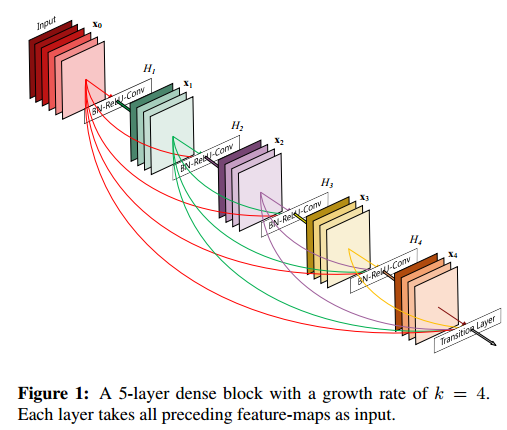
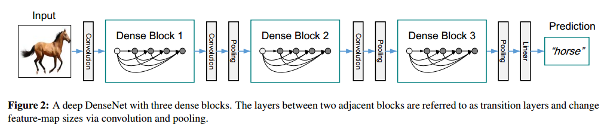
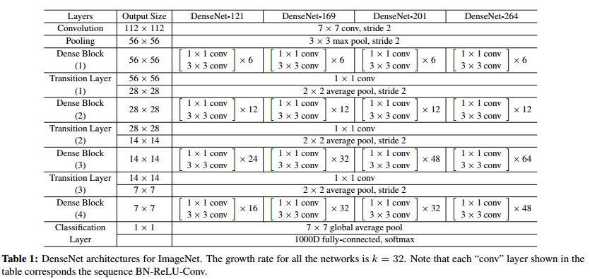
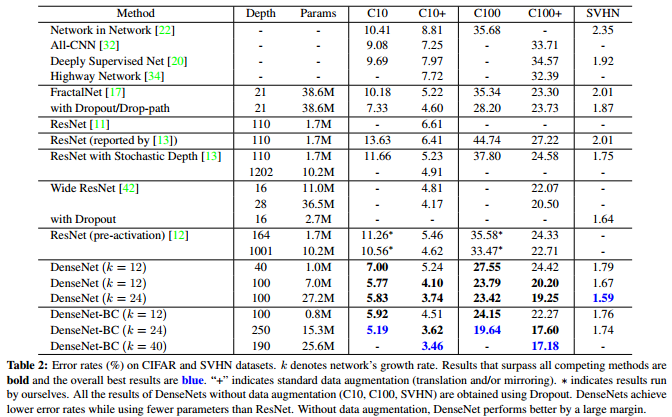
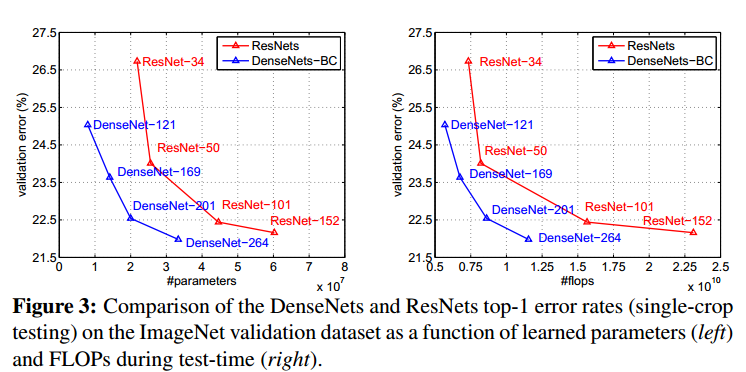

- [Back to README](../../README.md)

- [Visual Understanding](#visual-understanding)
  - [(****) Visualizing and Understanding Convolutional Networks, ECCV, 2014, paper](#visualizing-and-understanding-convolutional-networks-eccv-2014-paper)
  - [(***) Learning How to Explain Neural networks：PatterNnet and PatternAttribution, arXiv, 2017, paper](#learning-how-to-explain-neural-networkspatternnet-and-patternattribution-arxiv-2017-paper)
- [Classification](#classification)
  - [(****) Densely Connected Convolutional Networks, CVPR, 2017, paper](#densely-connected-convolutional-networks-cvpr-2017-paper)

## Classification

### (****) Densely Connected Convolutional Networks, CVPR, 2017, [paper](https://ieeexplore.ieee.org/document/8099726)

**Problem** 
- As CNNs become increasingly deep, a new research problem emerges: as information about the input or gradient passes through many layers, it can vanish and “wash out” by the time it reaches the end (or beginning) of the network.

**Contribuction** 

- we propose an architecture that distills this insight into a simple connectivity pattern: **to ensure maximum information flow between layers in the network**, we connect all layers (with matching feature-map sizes) directly with each other. 
- A possibly counter-intuitive effect of this dense connectivity pattern is that **it requires fewer parameters than traditional convolutional networks**, as there is no need to relearn redundant feature-maps.
- Besides better parameter efficiency, one big advantage of DenseNets is their **improved flow of information and gradients  throughout the network, which makes them easy to train.**
- Further, we also observe that dense connections have a regularizing effect, which **reduces overfitting on tasks with smaller training set sizes**.
- DenseNets **perform a similar deep supervision in an implicit fashion**: a single classifier on top of the network provides direct supervision to all layers through at most two or
three transition layers. 

**Method**

**Result and Conclusion**

- We showed that DenseNets scale naturally to hundreds of layers, while exhibiting no optimization difficulties. 
- Because of their compact internal representations and reduced feature redundancy, DenseNets may be good feature extractors for various computer vision tasks that build on convolutional features