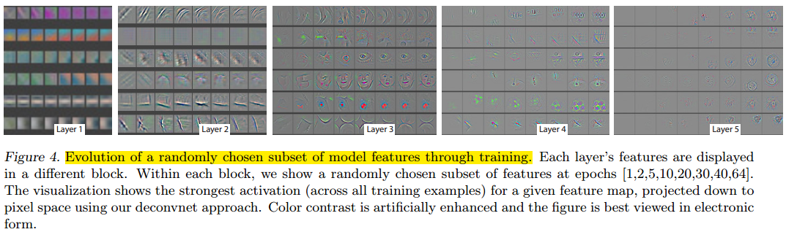

- [Back to README](../../README.md)

- [Visual Understanding](#visual-understanding)
  - [(****) Visualizing and Understanding Convolutional Networks, ECCV, 2014, paper](#visualizing-and-understanding-convolutional-networks-eccv-2014-paper)
  - [(***) Learning How to Explain Neural networks：PatterNnet and PatternAttribution, arXiv, 2017, paper](#learning-how-to-explain-neural-networkspatternnet-and-patternattribution-arxiv-2017-paper)

## Visual Understanding

### (****) Visualizing and Understanding Convolutional Networks, ECCV, 2014, [paper](https://arxiv.org/abs/1311.2901)

**Problem**
- Large Convolutional Network models have recently demonstrated impressive classification performance on the ImageNet benchmark
- However there is no clear understanding of why they perform so well, or how they might be improved,  or how they might be improved.

**Contribuctions**
- We introduce a novel visualization technique that gives insight into the function of intermediate feature layers and the operation of the classifier.

**Results and Conclusions**
- Weight Evolution
  

- Invariance Analysis
  

- Architecture Selection 
  

- Occlusion Sensitivity
  

### (***) Learning How to Explain Neural networks：PatterNnet and PatternAttribution, arXiv, 2017, [paper](https://arxiv.org/abs/1705.05598)

**Problem**

- While deep neural networks learn efficient and powerful representations, they are often considered a ‘black-box’. 
- On the basis of our findings, we then propose PatternNet and PatternAttribution, which alleviate these flaws.
- Finally we apply our methods to practically relevant networks and datasets, and show that our approach produces qualitatively improved signal visualizations and attributions

**Contribuction**

- We first take a step back and analyze explanation methods in the context of the simplest neural network setting: a purely linear model and data stemming from a linear generative mode.
- On the basis of our findings, we then propose PatternNet and PatternAttribution, which alleviate these flaws.
-  Finally we apply our methods to practically relevant networks and datasets, and show that our approach produces qualitatively improved signal visualizations and attributions.

**Method**

**Result**

