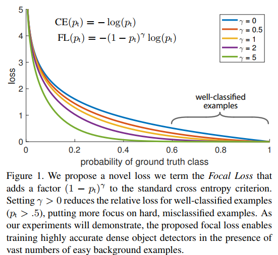
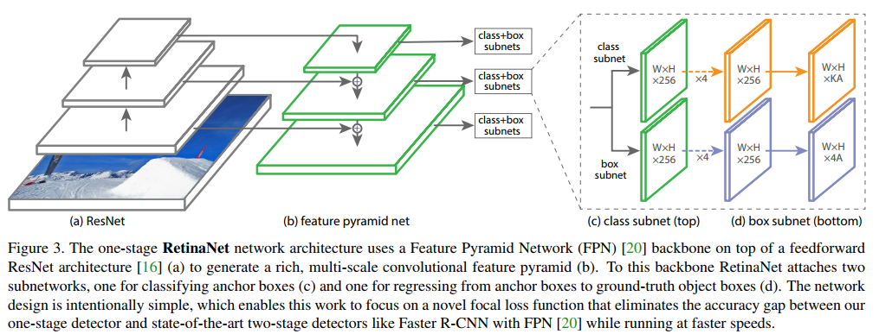
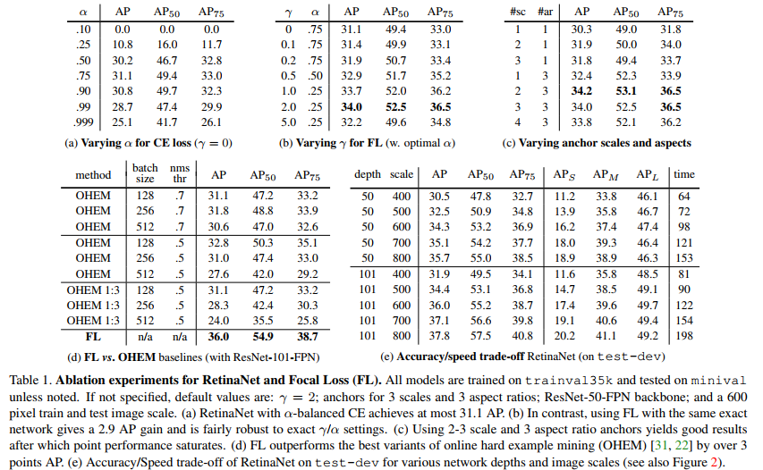
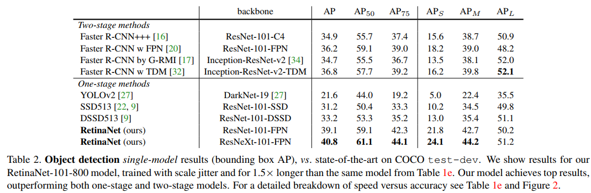

- [Back to README](../../README.md)

- [detection](#detection)
  - [(****) Focal Loss for Dense Object Detection, ICCV, 2017, code](#focal-loss-for-dense-object-detection-iccv-2017-code)

## detection

### (****) Focal Loss for Dense Object Detection, ICCV, 2017, [code](https://github.com/facebookresearch/Detectron)

**Problem**
- The highest accuracy object detectors to date are based on a two-stage approach popularized by R-CNN, where a classifier is applied to a sparse set of candidate object locations.
- In contrast, one-stage detectors that are applied over a regular, dense sampling of possible object locations have the potential to be faster and simpler, but have trailed the accuracy of two-stage detectors thus far. 
- In this paper, we investigate why this is the case
- We discover that the extreme foreground-background class imbalance encountered
during training of dense detectors is the central cause

**Contribution**

- In this paper, we propose a new loss function that acts as a more effective alternative to previous approaches for dealing with class imbalance.

**Method**

$$FL(p_t) = -\alpha_t(1 - p_t)^{\gamma}log(p_t)$$

**Result**

**Conclusion**

- we propose the focal loss which applies a modulating term to the cross entropy loss in order to focus learning on hard negative examples
- We demonstrate its efficacy by designing a fully convolutional one-stage detector and report extensive experimental analysis showing that it achieves stateof-the-art accuracy and speed