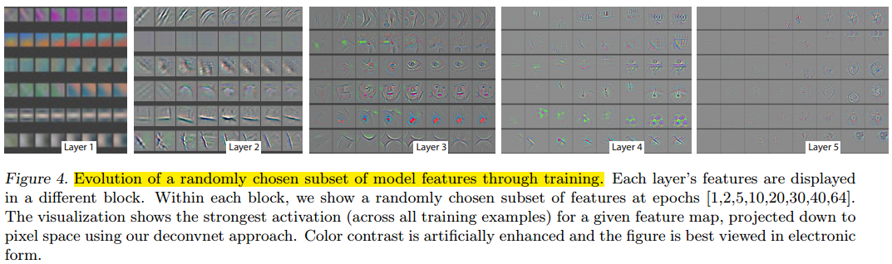
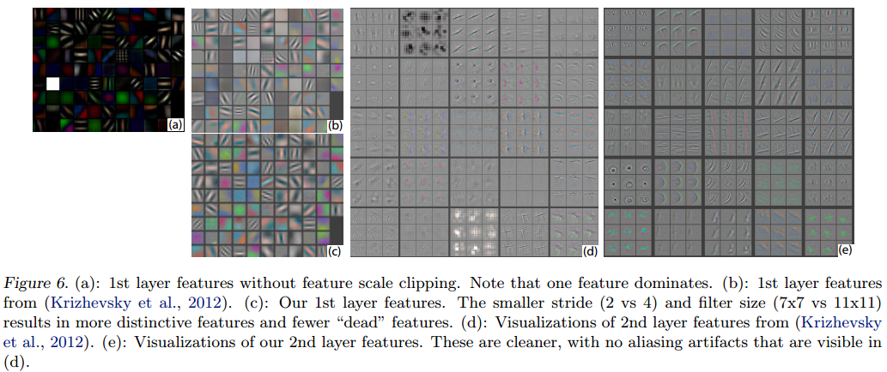

### Visualizing and Understanding Convolutional Networks, ECCV, 2014

**Problem**
- Large Convolutional Network models have recently demonstrated impressive classification performance on the ImageNet benchmark
- However there is no clear understanding of why they perform so well, or how they might be improved,  or how they might be improved.

**Contribuctions**
- We introduce a novel visualization technique that gives insight into the function of intermediate feature layers and the operation of the classifier.

**Results and Conclusions**
- Weight Evolution
  
- Invariance Analysis
  
- Architecture Selection 
  
- Occlusion Sensitivity
  