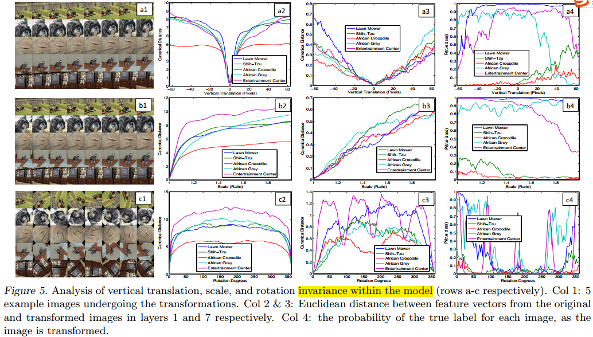
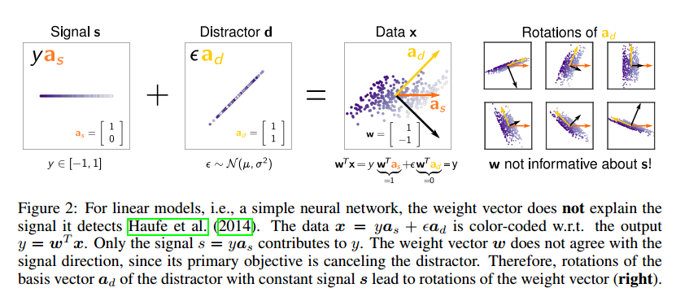
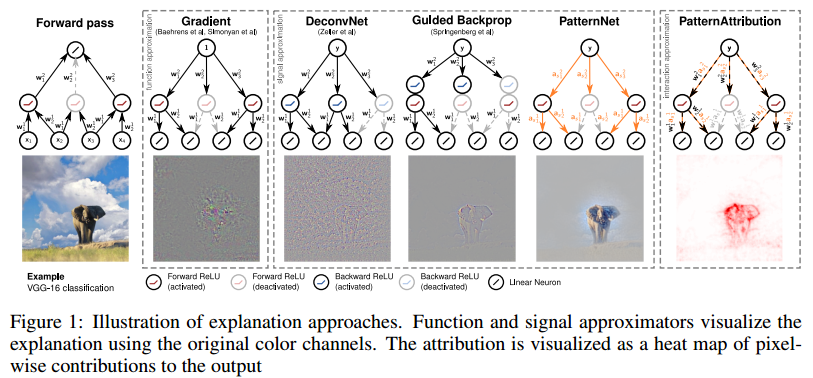
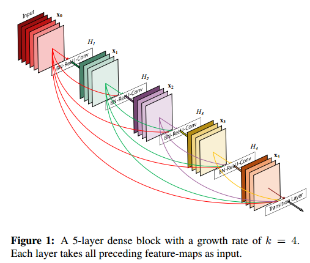
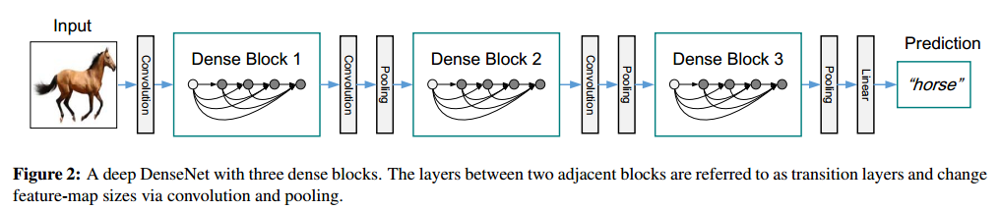
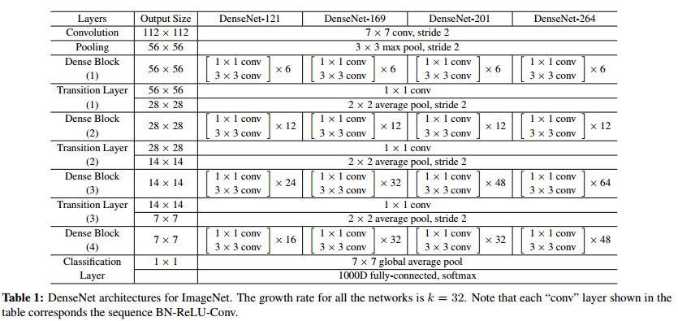
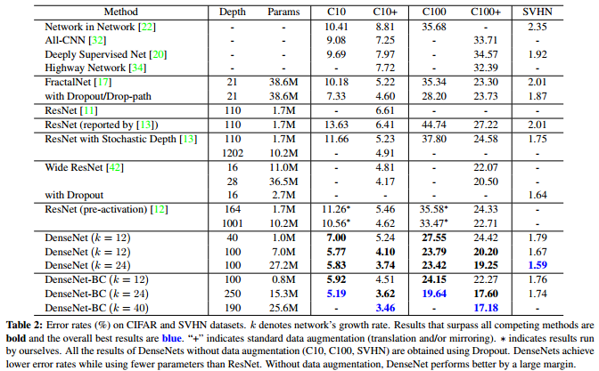
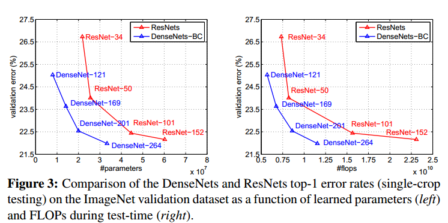

- [Visual Understanding](#visual-understanding)
  - [Visualizing and Understanding Convolutional Networks, ECCV, 2014](#visualizing-and-understanding-convolutional-networks-eccv-2014)
  - [Learning How to Explain Neural networks：PatterNnet and PatternAttribution, 2017](#learning-how-to-explain-neural-networkspatternnet-and-patternattribution-2017)
- [Classification](#classification)
  - [Densely Connected Convolutional Networks, 2016](#densely-connected-convolutional-networks-2016)

## Visual Understanding

### [Visualizing and Understanding Convolutional Networks](https://arxiv.org/abs/1311.2901), ECCV, 2014

**Problem**
- Large Convolutional Network models have recently demonstrated impressive classification performance on the ImageNet benchmark
- However there is no clear understanding of why they perform so well, or how they might be improved,  or how they might be improved.

**Contribuctions**
- We introduce a novel visualization technique that gives insight into the function of intermediate feature layers and the operation of the classifier.

**Results and Conclusions**
- Weight Evolution
  

- Invariance Analysis
  

- Architecture Selection 
  

- Occlusion Sensitivity
  

### [Learning How to Explain Neural networks：PatterNnet and PatternAttribution](https://arxiv.org/abs/1705.05598v2), 2017

**Problem**

- While deep neural networks learn efficient and powerful representations, they are often considered a ‘black-box’. 
- On the basis of our findings, we then propose PatternNet and PatternAttribution, which alleviate these flaws.
- Finally we apply our methods to practically relevant networks and datasets, and show that our approach produces qualitatively improved signal visualizations and attributions

**Contribuction**

- We first take a step back and analyze explanation methods in the context of the simplest neural network setting: a purely linear model and data stemming from a linear generative mode.
- On the basis of our findings, we then propose PatternNet and PatternAttribution, which alleviate these flaws.
-  Finally we apply our methods to practically relevant networks and datasets, and show that our approach produces qualitatively improved signal visualizations and attributions.

**Method**

**Result**

## Classification

### [Densely Connected Convolutional Networks](https://arxiv.org/abs/1608.06993), 2016

**Problem** 
- As CNNs become increasingly deep, a new research problem emerges: as information about the input or gradient passes through many layers, it can vanish and “wash out” by the time it reaches the end (or beginning) of the network.

**Contribuction** 

- we propose an architecture that distills this insight into a simple connectivity pattern: **to ensure maximum information flow between layers in the network**, we connect all layers (with matching feature-map sizes) directly with each other. 
- A possibly counter-intuitive effect of this dense connectivity pattern is that **it requires fewer parameters than traditional convolutional networks**, as there is no need to relearn redundant feature-maps.
- Besides better parameter efficiency, one big advantage of DenseNets is their **improved flow of information and gradients  throughout the network, which makes them easy to train.**
- Further, we also observe that dense connections have a regularizing effect, which **reduces overfitting on tasks with smaller training set sizes**.
- DenseNets **perform a similar deep supervision in an implicit fashion**: a single classifier on top of the network provides direct supervision to all layers through at most two or
three transition layers. 

**Method**

**Result and Conclusion**

- We showed that DenseNets scale naturally to hundreds of layers, while exhibiting no optimization difficulties. 
- Because of their compact internal representations and reduced feature redundancy, DenseNets may be good feature extractors for various computer vision tasks that build on convolutional features