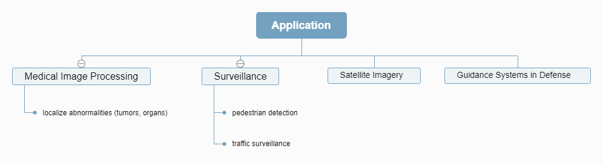
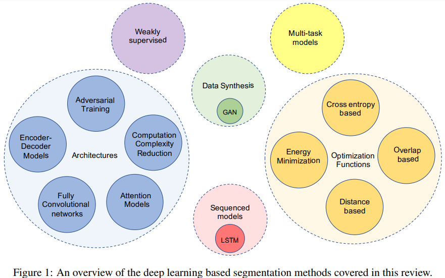

- [Back to README](../../README.md)

- [Segmentation Review](#segmentation-review)
  - [(***) Machine Learning Techniques for Biomedical Image Segmentation: An Overview of Technical Aspects and Introduction to State-of-Art Applications, Medical Physics, 2019, paper](#machine-learning-techniques-for-biomedical-image-segmentation-an-overview-of-technical-aspects-and-introduction-to-state-of-art-applications-medical-physics-2019-paper)
  - [(***) Understanding Deep Learning Techniques for Image Segmentation, ACM Computing Surveys, 2019, paper](#understanding-deep-learning-techniques-for-image-segmentation-acm-computing-surveys-2019-paper)
  - [(***) Deep Semantic Segmentation of Natural and Medical Images: A Review, arXiv, 2019, paper](#deep-semantic-segmentation-of-natural-and-medical-images-a-review-arxiv-2019-paper)

## Segmentation Review

### (***) Machine Learning Techniques for Biomedical Image Segmentation: An Overview of Technical Aspects and Introduction to State-of-Art Applications, Medical Physics, 2019, [paper](https://arxiv.org/abs/1911.02521)

**Comparision between Traditional Methods and Deep Learning based Methods** 

| Methods                              | Advantage                                                                              | Disadvantage                                                                           |
| ------------------------------------ | -------------------------------------------------------------------------------------- | -------------------------------------------------------------------------------------- |
| Gredient based methods               | Fast                                                                                   | Prone to image noise and artifacts that result in missing or diffuse organ boundaries. |
| Graph based methods (MRF et al.)     |                                                                                        | High computational cost due to iterative schedume.                                     |
| Superivsed methods + prior knowledge | capture shape well and generate more accurate results than unsupervised methods        | Limitated results when dealing with fuzzy boundaries                                   |
| Deep learning methods                | Automatic feature extration scheme instead of manual feature extraction, More accurate | Large computational cost, and large amount of data                                     |

**Deep Learning based Methods**

| Methods         | Advantage                         | Disadvantage                                                                                                                                                                   |
| --------------- | --------------------------------- | ------------------------------------------------------------------------------------------------------------------------------------------------------------------------------ |
| Patch based CNN | Alleviate the coputational burden | 1. loss of spatial infortation  2. too small patchs means less information could be extracted  3. may increase training time due to the duplicated computation of pixels |

| Challenges                                                | Current Solutions                                                                                                                                                                                    |
| --------------------------------------------------------- | ---------------------------------------------------------------------------------------------------------------------------------------------------------------------------------------------------- |
| Limited Training Data                                     | 1. Data Augmentation  2. Transfer Learning  2. Generate data using GAN                                                                                                                         |
| Volumetric 3D Data cost training time and computer memory | 1. use 2D segmentation architectures instead of 3D architectures  2. *use 2.5D architectures* (an input data as several slice images, orthogonal images, maximum or minimum intensity projection) |
| Requires a lot of Hyperprameter Tuning                    | None                                                                                                                                                                                                 |

### (***) Understanding Deep Learning Techniques for Image Segmentation, ACM Computing Surveys, 2019, [paper](https://arxiv.org/abs/1907.06119)

**Defination:**

- Image segmentation can be defined as a specific image processing technique which is used to divide an image into two or more meaningful regions.
- Image segmentation can also be seen as a process of defining boundaries between separate semantic entities in an image.
-  From a more technical perspective, image
segmentation is a process of assigning a label to each pixel in the image such that pixels with the same label are connected with respect to some **visual** or **semantic** property

**Categories**

| Categories            | Task                                                                                                                                                               | Notes                                                                                |
| --------------------- | ------------------------------------------------------------------------------------------------------------------------------------------------------------------ | ------------------------------------------------------------------------------------ |
| Semantic Segmentation | Each pixel is classified into one of the predefined set of classes such that pixels belonging to the same class belongs to an unique semantic entity in the image. | The semantics depends on the **data** and the **problem** that needs to be addressed |
| Saliency Detection    | focusing on the most important object in a scene                                                                                                                   |

**Application**

**Comparization**

|                  | Traditional Methods                                                                                                                                                   | Deep Learning Based Methods   |
| ---------------- | --------------------------------------------------------------------------------------------------------------------------------------------------------------------- | ----------------------------- |
| **Advantage**    |                                                                                                                                                                       | 1. automated feature learning |
| **Disadvantage** | 1. the results dependent on the quality of feature extracted by the domain experts  2. humans are bound to miss latent or abstract features for image segmentation |

### (***) Deep Semantic Segmentation of Natural and Medical Images: A Review, arXiv, 2019, [paper](https://arxiv.org/abs/1910.07655)

**Categories:**

**Potentional Difficulty**

| difficulty                                          | solutions                                                                     | pros                  | cons                                                                  |
| --------------------------------------------------- | ----------------------------------------------------------------------------- | --------------------- | --------------------------------------------------------------------- |
| medical image can be in high dimentions (2D and 3D) | processed as sub-volumes (images)                                             | reduce computing cost | prevent models capturing spatial information / relationships properly |
| lack of annotated data                              | 1. semi- or un-supervised learning  2. encoding prior knowledge into model |

**Potential Future Directions**

- Going beyond pixel intensity-based scene understanding via incorporating prior knowledge.
- Creating large 2D and 3D publicly available medical benchmark datasets for semantic image segmentation such as the Medical Segmentation Decathlon.
- Exploring reinforcement learning approaches for semantic (medical) image segmentation to mimic the way human does delineation.