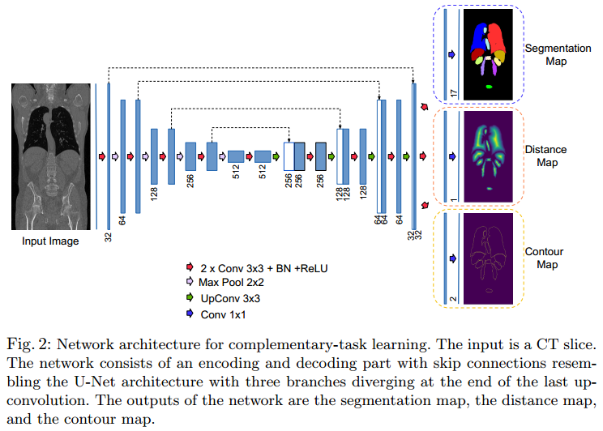

- [Back to README](../../README.md)
- [Boundary and Distance Map](#boundary-and-distance-map)
  - [(***) Shape-Aware Complementary-Task Learning for Multi-Organ Segmentation, MICCAI 2019, paper](#shape-aware-complementary-task-learning-for-multi-organ-segmentation-miccai-2019-paper)

## Boundary and Distance Map
### (***) Shape-Aware Complementary-Task Learning for Multi-Organ Segmentation, MICCAI 2019, [paper](https://arxiv.org/abs/1908.05099)

**Problem**
- In representation learning, auxiliary-tasks are often designed to leverage free-of-cost supervision which is derived from existing target labels
- The purpose of including auxiliary tasks is not only to learn a shared representation but also to learn efficiently by solving the common *meta-objective*

**Contribuction**
- We introduce two complementary-tasks in context of organ-specific shapeprior learning. We show that the inclusion of these complementary-tasks
alongside the segmentation task improves its overall performance.

**Result and Conclusion**

-  In medical image segmentation where large data sets are scarce and corresponding dense annotation is expensive, designing complementary-task by leveraging existing target label could be beneficial to learn a generalized representation