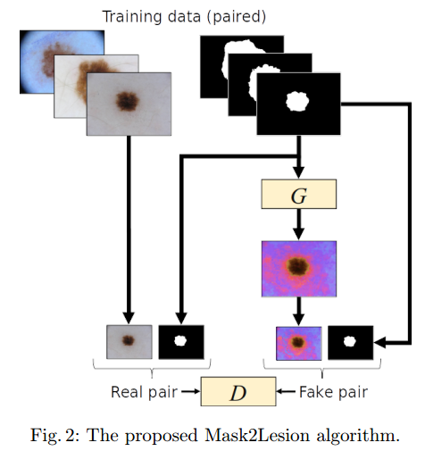
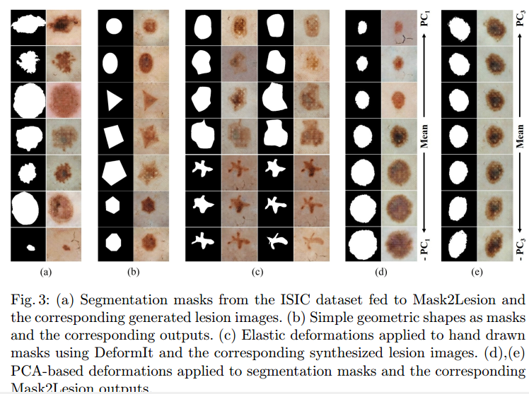

- [Back to README](../../README.md)

- [Data Augmentation](#data-augmentation)
  - [(***) Mask2Lesion: Mask-Constrained Adversarial Skin Lesion Image Synthesis. Simulation and Synthesis in Medical Imaging, 2019. paper](#mask2lesion-mask-constrained-adversarial-skin-lesion-image-synthesis-simulation-and-synthesis-in-medical-imaging-2019-paper)

## Data Augmentation

### (***) Mask2Lesion: Mask-Constrained Adversarial Skin Lesion Image Synthesis. Simulation and Synthesis in Medical Imaging, 2019. [paper](https://arxiv.org/abs/1906.05845)

**Contribution**
- propose a GAN-based augmentation of the original dataset in order to improve the segmentation performance
- use the segmentation masks available in the training dataset to
train the Mask2Lesion model, and use the model to generate new lesion images given any arbitrary mask, which are then used to augment the original training dataset

**Pros**

The trained mask2lesion model can generate original images using only arbitrary binary mask, thus can be easily applied to other dataset.

**Cons**

don't know