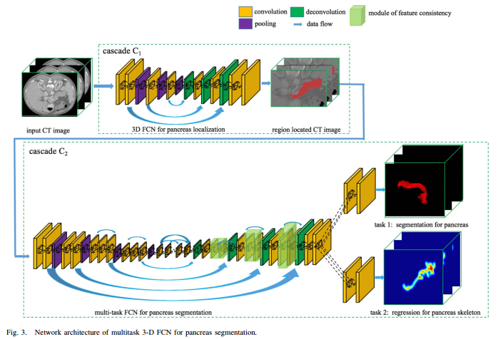
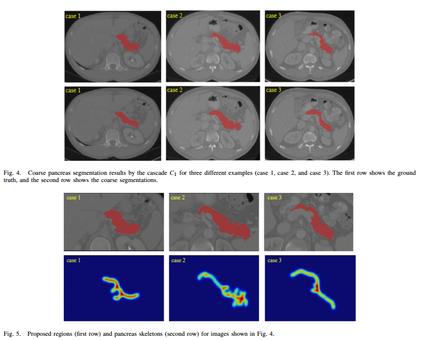
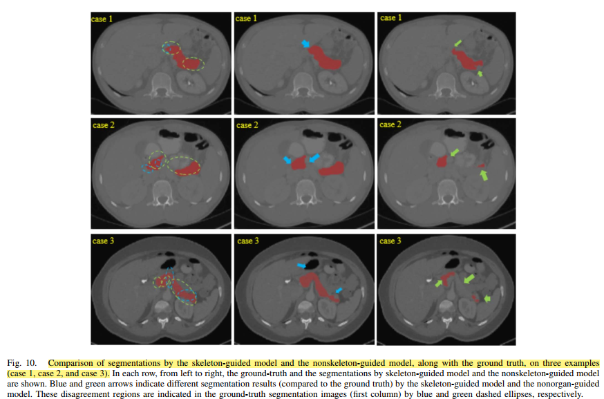

- [Back to README](../../README.md)

## Multi-Task Segmentation

### (****) Cascaded MultiTask 3-D Fully Convolutional Networks for Pancreas Segmentation, IEEE TRANSACTIONS ON CYBERNETICS, 2018. [paper](https://ieeexplore.ieee.org/stamp/stamp.jsp?arnumber=8936540)

**My comments:** Although this paper is not that novel in terms of methodolody, the experiment results and comparision are detail, thus worth learning.

**Problem**
- Automatic pancreas segmentation is crucial to the diagnostic assessment of diabetes or pancreatic cancer. 
- However, the **relatively small size of the pancreas** in the upper body, as well as **large variations of its location and shape** in retroperitoneum, make the segmentation task challenging.

**Contribtion**
- We propose a cascaded shape-specific cues-guided FCN, composed of two major cascaded stages
- We adopt guidance from the pancreas skeleton to help the segmentation network to better learn the segmentation task.
- We propose a novel 3-D multitask framework for volumetric pancreas segmentation.

**Methods**
-  The bounding box of pancreas is obtained by morphological operation on this coarse segmentation. The intermediate point of the bounding box is selected as the centroid to crop the region of size 128×224×224 from the raw CT images.
- Note that the ground-truth skeleton is only needed in the training phase, which can be actually obtained by morphological operation, followed by smoothing with a Gaussian filter.

- 

**Result and Conclusion**

- our proposed method is more accurate than the state-of-the-art methods, and is also more robust across two different datasets. Finally, the ablation study also demonstrates that our proposed module does contribute to the performance gain