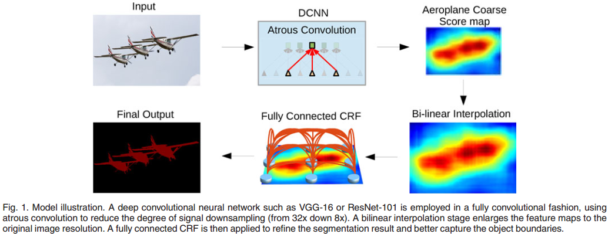
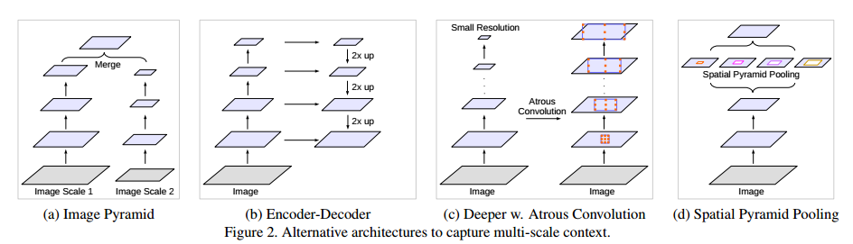
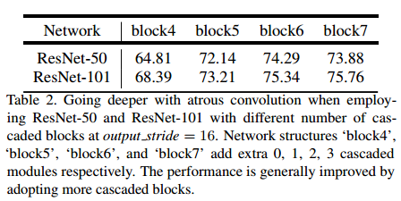
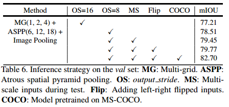

- [Back to README](../../README.md)
- [Multiscale Semantic Segmentation](#multiscale-semantic-segmentation)
  - [(****) DeepLab: Semantic Image Segmentation with Deep Convolutional Nets, Atrous Convolution, and Fully Connected CRFs, PAMI, 2018, paper](#deeplab-semantic-image-segmentation-with-deep-convolutional-nets-atrous-convolution-and-fully-connected-crfs-pami-2018-paper)
  - [(****) Rethinking Atrous Convolution for Semantic Image Segmentation, Arxiv, 2017, paper](#rethinking-atrous-convolution-for-semantic-image-segmentation-arxiv-2017-paper)
  - [(***) Understanding Convolution for Semantic Segmentation, WACV, 2018, paper](#understanding-convolution-for-semantic-segmentation-wacv-2018-paper)
  - [(****) Encoder-Decoder with Atrous Separable Convolution for Semantic Image Segmentation (Deeplab V3+), ECCV 2018, paper](#encoder-decoder-with-atrous-separable-convolution-for-semantic-image-segmentation-deeplab-v3-eccv-2018-paper)

## Multiscale Semantic Segmentation

### (****) DeepLab: Semantic Image Segmentation with Deep Convolutional Nets, Atrous Convolution, and Fully Connected CRFs, PAMI, 2018, [paper](https://ieeexplore.ieee.org/document/7913730)

**Challenges and Solution**
| Challenge | Solution |
| --------- | -------- |
|The first challenge is caused by the repeated combination of max-pooling and downsampling (‘striding’) performed at consecutive layers of DCNNs originally designed for image classification. | we remove the downsampling operator from the last few max-pooling layers of DCNNs and instead upsample the filters in subsequent convolutional layers, resulting in feature maps computed at a higher sampling rate |
| The second challenge is caused by the existence of objects at multiple scales. | Instead, motivated by spatial pyramid pooling [19], [20], we propose a computationally efficient scheme of resampling a given feature layer at multiple rates prior to convolution |
| The third challenge relates to the fact that an object-centric classifier requires invariance to spatial transformations, inherently limiting the spatial accuracy of a DCNN. | we boost our model’s ability to capture fine details by employing a fully-connected Conditional Random Field (CRF) |

**Useful Information**
- Compared to regular convolution with larger filters, atrous convolution allows us to effectively enlarge the field of view of filters without increasing the number of parameters or the amount of computation.

**Method**

**Result and Conclusion**

- Our experimental results show that the proposed method significantly advances the state-of-art in several challenging datasets, including PASCAL VOC 2012 semantic image segmentation benchmark, PASCAL-Context, PASCAL-Person-Part, and Cityscapes datasets

### (****) Rethinking Atrous Convolution for Semantic Image Segmentation, Arxiv, 2017, [paper](https://arxiv.org/abs/1706.05587)

**Challenges and Problems**
- The first one is the **reduced feature resolution** caused by consecutive pooling operations or convolution striding, which allows DCNNs to learn increasingly abstract feature representations. However, this invariance to local image transformation may impede dense prediction tasks, **where detailed spatial information is desired**. 
- Another difficult comes from the existence of **objects at multiple scales.**

**Different Models on Multiscale Object Segmentation**

| Architecture | pros | cons |
| ------------ | ----- | ---- |
| Image Pyramid | can extract features for each scale input | 1. The main drawback of this type of models is that it does not scale well for larger/deeper DCNNs due to limited GPU memory and thus it is usually applied during the inference stage  2. This method works but comes at the cost of computing feature responses at all DCNN layers for multiple scaled versions of the input image |
| Encorder-Decorder Structure | 1. the encoder where the spatial dimension of feature maps is gradually reduced and thus longer range information is more easily captured in the deeper encoder output  2. the decoder where object details and spatial dimension are gradually recovered | More couputational memory |
| Context Module | contains extra modules laid out in cascade to encode long-range context, for example Dense CRF |  |
| Spatial pyramid pooling | capture context at several ranges |  |

**Contribution**
- In this work, we mainly explore atrous convolution as a **context module** and tool for **spatial pyramid pooling.**
- To further capture global context, we propose to augment ASPP with
image-level features, similar to [58, 95].

**Result and Conclusion**

- Going deeper with atrous convolution
  
  This results illustrate that consecutive striding is harmful for semantic segmentation.

  
  This results show that the performance improves as more blocks are added, but the margin of improvement becomes smaller.

- Atrous Spatial Pyramid Pooling
  

### (***) Understanding Convolution for Semantic Segmentation, WACV, 2018, [paper](https://arxiv.org/abs/1702.08502)

**Contribution**

- First, we design dense upsampling convolution (DUC) to generate
pixel-level prediction, which is able to capture and decode more detailed information that is generally missing in bilinear upsampling.
- Second, we propose a hybrid dilated convolution (HDC) framework in the encoding phase. This framework 1) effectively enlarges the receptive fields (RF) of the network to aggregate global information; 2) alleviates what we call the “gridding issue”caused by the standard dilated convolution operation. 

**Results and Conclusion**

- We designed a new dense upsampling convolution (DUC) operation to enable pixel-level prediction on feature maps, and hybrid dilated convolution (HDC) to solve the gridding problem, effectively enlarging the receptive fields of the network.
- Experimental results demonstrate the effectiveness of our framework on various semantic segmentation tasks

### (****) Encoder-Decoder with Atrous Separable Convolution for Semantic Image Segmentation (Deeplab V3+), ECCV 2018, [paper](https://arxiv.org/abs/1802.02611)

**Problem**

- Spatial pyramid pooling module or encode-decoder structure are used in deep neural networks for semantic segmentation task.
- The former networks are able to encode multi-scale contextual information by probing the incoming features with filters or pooling operations at multiple rates and multiple effective fields-of-view, while the latter networks can capture sharper object boundaries by gradually recovering the spatial information
- In this work, we propose to combine the advantages from both methods.

**Contribuction**

- We propose a novel encoder-decoder structure which **employs DeepLabv3 as a powerful encoder module** and a simple yet effective decoder module.
- In our structure, **one can arbitrarily control the resolution of extracted encoder features by atrous convolution to trade-off precision and runtime**,
which is not possible with existing encoder-decoder models.
- We **adapt the Xception model for the segmentation task** and apply depthwise separable convolution to both ASPP module and decoder module, resulting in a faster and stronger encoder-decoder network.
- [code available (Tensorflow)](https://github.com/tensorflow/models/tree/master/research/deeplab).
  
**Method**

**Result**

- Our proposed model DeepLabv3+ employs the encoder-decoder structure where DeepLabv3 is used to encode the rich contextual information and a simple yet effective decoder module is adopted to recover the object boundaries.