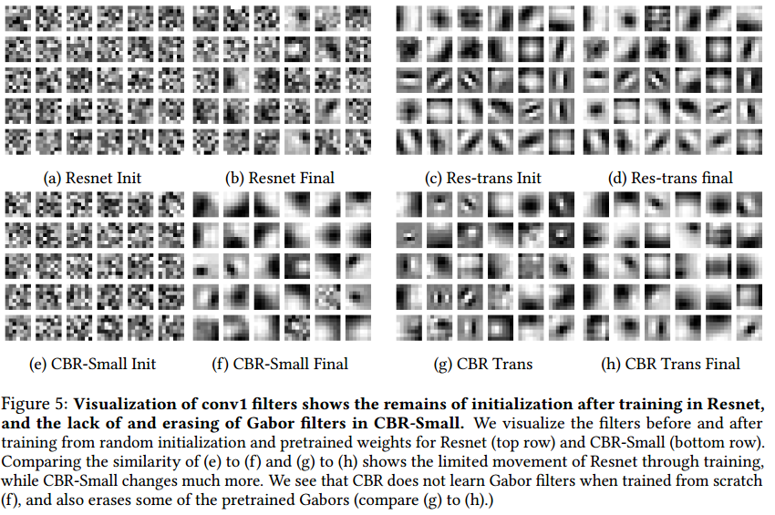
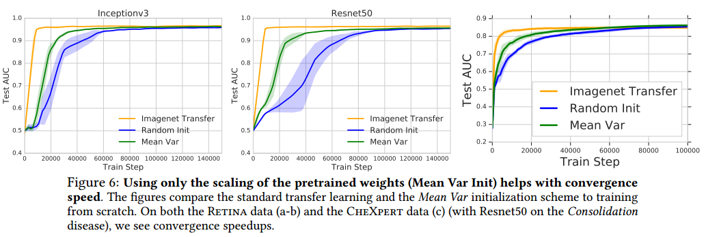

- [Back to README](../../README.md)

- [Transfer Learning](#transfer-learning)
  - [(****) Transfusion: Understanding Transfer Learning for Medical Imaging. NeurIPS 2019, paper](#transfusion-understanding-transfer-learning-for-medical-imaging-neurips-2019-paper)

## Transfer Learning

### (****) Transfusion: Understanding Transfer Learning for Medical Imaging. NeurIPS 2019, [paper](https://arxiv.org/abs/1902.07208) 

**Problem**
- transfer learning is typically performed by taking a standard ImageNet architecture along with its pretrained weights, and then fine-tuning on the target task
- However, ImageNet classifcation and medical image diagnosis have considerable diferences.
-  There is thus an open question of how much ImageNet feature reuse is helpful for medical images?

**Difference between natural image classcification and medical image analysis**

|                   | ImageNet dataset                                   | Medical image dataset                                |
| ----------------- | -------------------------------------------------- | ---------------------------------------------------- |
| **Classes**       | 1000                                               | less than 10 in most tasks                           |
| **image size**    | smaller                                            | larger than natural image                            |
| **Dataset size**  | a million                                          | several thousands or a couple of hundred             |
| **data property** | there is often a clear global subject of the image | variations in local textures to identify pathologies |

**Contribution**
-  evaluate the performance of standard architectures for natural images such as ImageNet, as well as a family of non-standard but smaller and simpler models, on two large scale medical imaging tasks, for which transfer learning is currently the norm
-  We show there are also feature-independent benefits to pretraining — reusing only the scaling of the pre-trained weights but not the features can itself **lead to large gains in convergence speed**.

**Results**

- in all of these cases, transfer does not signifcantly help performance
- smaller, simpler convolutional architectures perform comparably to standard ImageNet models
- ImageNet performance is not predictive of medical performance.