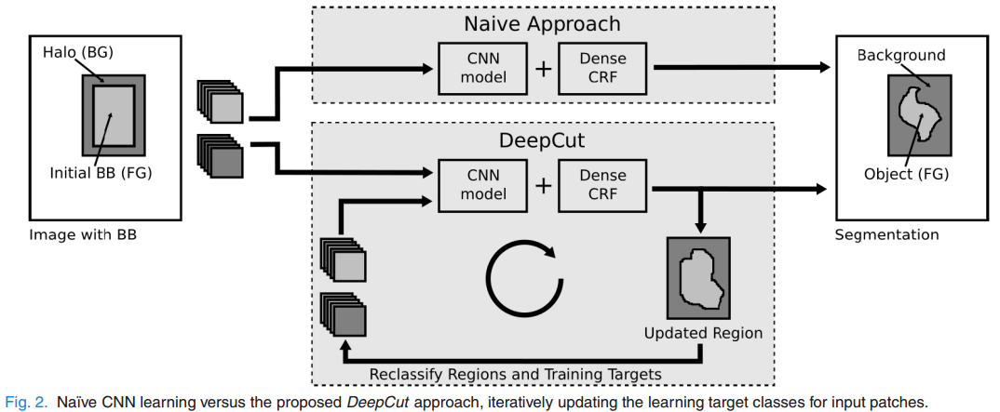
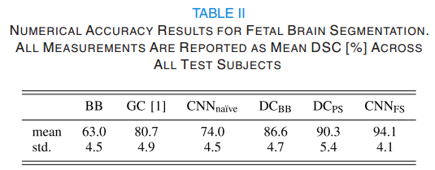
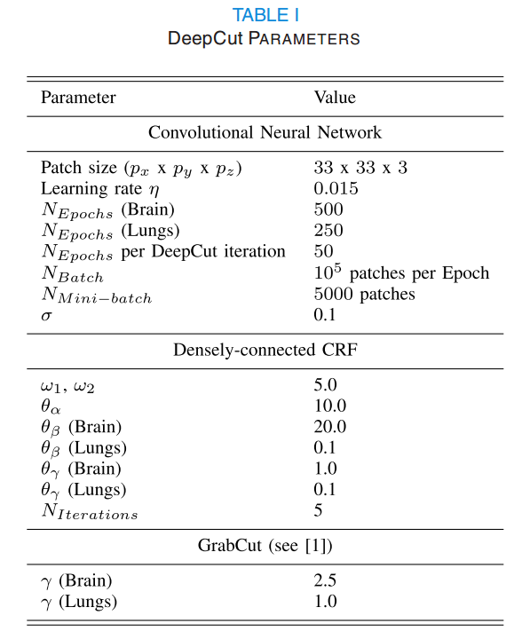

- [Back to README](../../README.md)
- [Weakly Supervised Segmentation](#weakly-supervised-segmentation)
  - [(****) DeepCut: Object Segmentation From Bounding Box Annotations Using Convolutional Neural Networks, TMI, 2017](#deepcut-object-segmentation-from-bounding-box-annotations-using-convolutional-neural-networks-tmi-2017)

## Weakly Supervised Segmentation

### (****) DeepCut: Object Segmentation From Bounding Box Annotations Using Convolutional Neural Networks, TMI, 2017

**Problem**
- many modern medical image analysis methods that are based on machine learning rely on large amounts of annotations to properly cover the variability in the data.
-  However, the effort for a single rater to annotate a large training set is often not feasible.

**Contribution**
- We extend the basic idea with recent advances in CNN
modelling and propose DeepCut, a method to recover semantic
segmentations given a database of images with corresponding
bounding boxes.

**Results**

**Limitations**

- The default CRF parameters θ and ω in [19] (see Tab. I) were not appropriate for medical images and required tuning.
- Further, the time required for training of one epoch was approximately 9 minutes and inference during testing (including CRF) was less than 8 minutes for the largest MR volume.
- these might be modality and problem dependent, requiring adjustment when translating DeepCut to new segmentation problems.