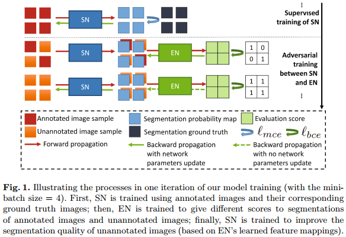
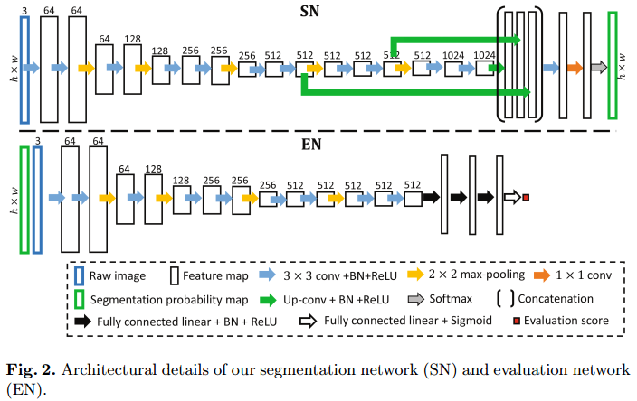
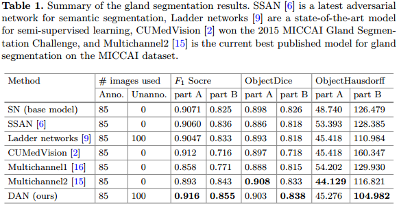
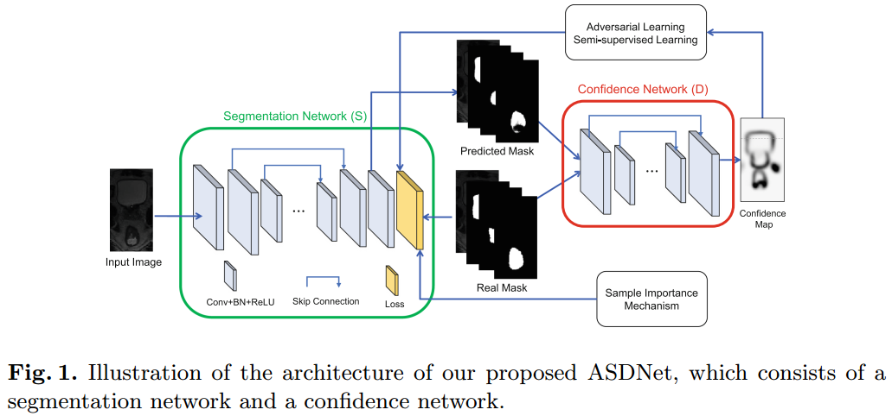
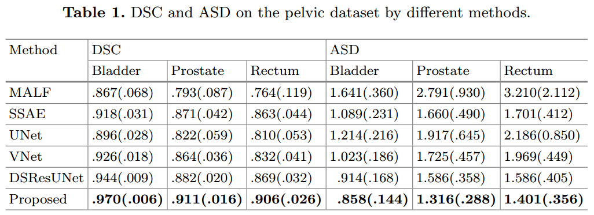
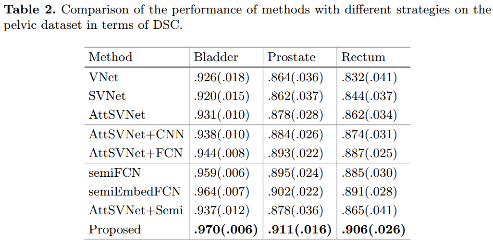

- [Semi-Spuervised Learning](#semi-spuervised-learning)
  - [Deep Adversarial Networks for Biomedical Image Segmentation Utilizing Unannotated Images, MICCAI, 2017](#deep-adversarial-networks-for-biomedical-image-segmentation-utilizing-unannotated-images-miccai-2017)
  - [ASDNet: Attention Based Semi-supervised Deep Networks for Medical Image Segmentation, MICCAI, 2018](#asdnet-attention-based-semi-supervised-deep-networks-for-medical-image-segmentation-miccai-2018)

## Semi-Spuervised Learning

### Deep Adversarial Networks for Biomedical Image Segmentation Utilizing Unannotated Images, MICCAI, 2017

**disadvantages of weakly supervised segmetation**
- for boundbox level: drawing bounding box still requires a lot of efforts for some applications (for example, cells)
- for instance level: there can be much fewer object classes in biomedical images than natural scene images, and image level labels may be less useful in biomedical settings since almost all the images may contain all the object classes for segmentation (e.g., cells, glands).

**Contribuction**
- propose a new adversarial training approach for producing consistently good segmentaiton for both annotated images and unannotated images.
- the DAN based method consists a segmentaiton network and an evaluation network.
  

**Results**

The segmetation result did not improve much according to this table.

**Advantages and Disadvantages**
- adv: the introduce of evaluation netowrk can help using annotated images for segmentation.
- disadv: **the EN evaluates the segmentaiton result in a image level may be unstable, an pixel level EN is expected to construct**

### ASDNet: Attention Based Semi-supervised Deep Networks for Medical Image Segmentation, MICCAI, 2018

**Problem**
- 

**Contribuction**
-  we propose a fully convolutional confidence network to adversarially train the segmentation network
-  we then propose a region-attention based semi-supervised learning strategy to include the unlabeled data for training

**Result and Conclusion**

-  our proposed ASDNet has achieved significant improvement in terms of both accuracy and robustness.

**Disadvantages**

The input of the ealuation network takes segmetation result as input, which **overlooked the correlation between original image and it's segmentation result**