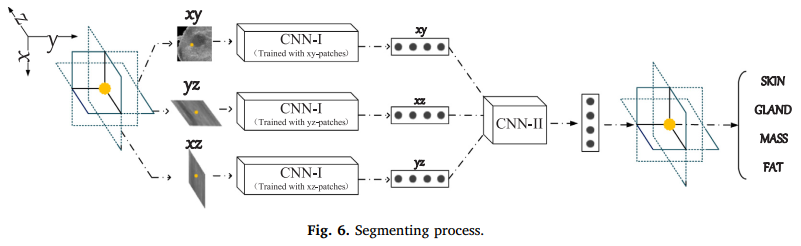
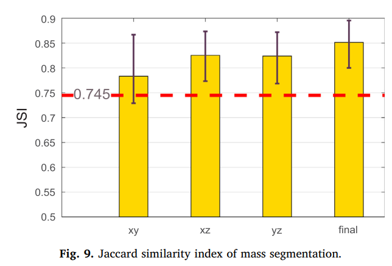
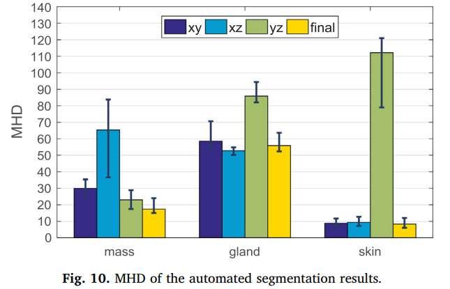
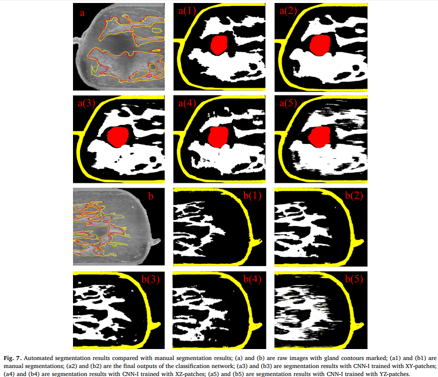

- [Ultrasound Image Segmentation](#ultrasound-image-segmentation)
  - [(**) Medical breast ultrasound image segmentation by machine learning, Ultrasonics, 2019, paper](#medical-breast-ultrasound-image-segmentation-by-machine-learning-ultrasonics-2019-paper)
  - [(****) Cascaded Fully Convolutional Networks for automatic prenatal ultrasound image segmentation, ISBI, 2017, paper](#cascaded-fully-convolutional-networks-for-automatic-prenatal-ultrasound-image-segmentation-isbi-2017-paper)
  - [(****) Deep Attentive Features for Prostate Segmentation in 3D Transrectal Ultrasound, TMI, 2019, paper](#deep-attentive-features-for-prostate-segmentation-in-3d-transrectal-ultrasound-tmi-2019-paper)
  - [(***) Channel Attention Module with Multi-scale Grid Average Pooling for Breast Cancer Segmentation in an Ultrasound Image, IEEE transections on ultrasonics, 2020, paper](#channel-attention-module-with-multi-scale-grid-average-pooling-for-breast-cancer-segmentation-in-an-ultrasound-image-ieee-transections-on-ultrasonics-2020-paper)
  - [(***) Auto-context Fully Convolutional Network for Levator Hiatus Segmentation in Ultirasound Images, ISBI 2018](#auto-context-fully-convolutional-network-for-levator-hiatus-segmentation-in-ultirasound-images-isbi-2018)

## Ultrasound Image Segmentation

### (**) Medical breast ultrasound image segmentation by machine learning, Ultrasonics, 2019, [paper](https://www.ncbi.nlm.nih.gov/pubmed/30029074)

**Problem**

-  manually segmenting the ultrasound images, which is skill and experience dependent, would lead to a subjective diagnosis
-  it is time-consuming for radiologists to review hundreds of clinical images

**Contribution**

- In this paper, we propose to use convolutional neural networks (CNNs) for segmenting breast ultrasound images into four major tissues: skin, fibroglandular tissue, mass, and fatty tissue, on three-dimensional (3D) breast ultrasound images

**Method**

**Result and Discusion**

- the proposed automated segmentation method might have the potential to provide an objective reference for radiologists on breast image segmentation, so as to help breast cancer diagnosis and breast density assessments

### (****) Cascaded Fully Convolutional Networks for automatic prenatal ultrasound image segmentation, ISBI, 2017, [paper](https://ieeexplore.ieee.org/document/7950607)

**pros and cons of ultrasound imaging**

| pros                                                          | cons                                                                                                              |
| ------------------------------------------------------------- | ----------------------------------------------------------------------------------------------------------------- |
| 1. real time imaging  2. low cost  3. free of radiation | 1. various intensity distribuction  2. boundary ambiguities  3. structures deform due to different pressure |

**Challenges**
- Firstly, US images often present various intensity distributions due to different imaging conditions
- Secondly, a number of factors including acoustic shadows, speckle noise and low contrast between objects and surrounding tissues cause the typical boundary ambiguities and long-span occlusion
- Thirdly, different press sources tend to make the fetal anatomical structures deform.

**Contribution**

- We get a good starting point by tailoring the FCN-8s for considering both low model complexity and high segmentation
accuracy
- Implanting our tailored FCN into an **Auto-Context scheme** enhances the boundary details by dynamically exploring local context, and thus gains remarkable improvement from level to level.
- Additionally, we provide a new perspective to the classical Auto-Context scheme with the investigation on two types of join operators.

**Result and Conclusion**

- The proposed casFCN framework is general and can be easily extended to
other US image segmentation tasks.

### (****) Deep Attentive Features for Prostate Segmentation in 3D Transrectal Ultrasound, TMI, 2019, [paper](https://ieeexplore.ieee.org/document/8698868)

**Problem**
- manual outlining is tedious, time-consuming and often irreproducible, even for experienced physicians.
- the ambiguous boundary caused by poor contrast between the prostate and surrounding tissues
- missing boundary segments result from acoustic shadow and the presence of other structures (e.g. the urethra)
- inhomogeneous intensity distribution of the prostate tissue
in TRUS images
-  the large shape variations of different prostates

**Contribuction**
- We propose to fully exploit the useful complementary information encoded in the multi-level features to
refine the features at each individual layer. 
- We develop a 3D attention guided network with a novel scheme for TRUS prostate segmentation by harnessing the spatial contexts across deep and shallow layer

**Result and Conclusion**

- Our key idea is to select the useful complementary
information from the multi-level features to refine the features at each individual layer.
- Experiments on challenging TRUS volumes show that our segmentation using deep attentive features achieves satisfactory performance. In addition, the proposed attention mechanism is a general strategy to aggregate multi-level features and has the potential to be used for other medical image segmentation and detection tasks.

### (***) Channel Attention Module with Multi-scale Grid Average Pooling for Breast Cancer Segmentation in an Ultrasound Image, IEEE transections on ultrasonics, 2020, [paper](https://www.ncbi.nlm.nih.gov/pubmed/32054578)

**Problem**
-  recently proposed methods such as FCN, SegNet and U-Net still need to be further improved to provide better semantic segmentation when diagnosing breast cancer by ultrasound imaging, because of their low performance.
- only local information within receptive fields is
used, global information on an input image is lost during the
process of the architectures

**Contribuction**
- we propose a novel **channel attention module** with **multi-scale grid average pooling**, that is capable of improving the performance of CNNs for breast cancer segmentation in an ultrasound image.
- we demonstrate that a channel attention module using grid average pooling instead of global average pooling can improve segmentation performance, by using the local information of an input image

**Result and Conclusion**

- The channel attention module with multi-scale grid average pooling (MSGRAP) allowed maintaining local and global information for the semantic segmentation of breast tumors in ultrasound images. In contrast, the channel attention module with global average pooling could only maintain global information

### (***) Auto-context Fully Convolutional Network for Levator Hiatus Segmentation in Ultirasound Images, ISBI 2018

**Problem**
- Developing automatic methods for the levator hiatus (LH) segmentation is a necessary and crucial image-processing issue that needs to be resolved to achieve more objective and efficient female pelvic floor dysfunction (FPFD) examinations.

**Contribuction**
- a **customized FCN** is integrated with the **auto-context model** for iteratively refining the prediction map.
  
  

**Result and Conclusion**

