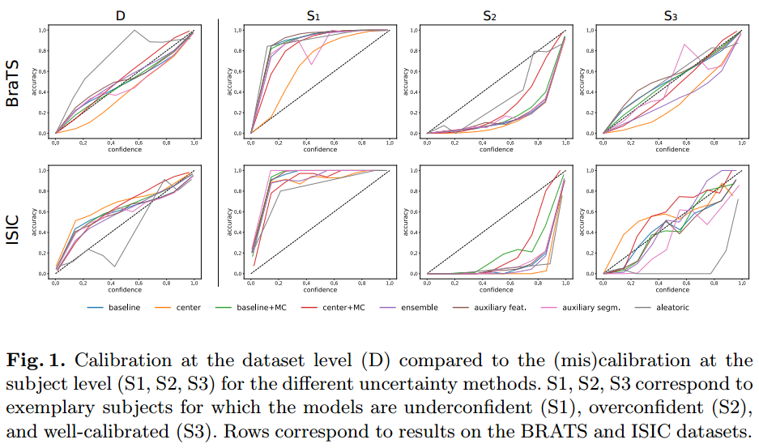

### A. Jungo and M. Reyes, “Assessing Reliability and Challenges of Uncertainty Estimations for Medical Image Segmentation,” in Medical Image Computing and Computer Assisted Intervention – MICCAI 2019, Cham, 2019, pp. 48–56, doi: 10.1007/978-3-030-32245-8_6.

**Problem**
- despite improvements in accuracy, the robustness aspects of these systems call for significant improvements for a successful clinical integration of these technologies, where each data point corresponds to an individual patient
- This highlights the importance of having mechanisms to effectively monitor computer results in order to detect and react on system’s failures at the patient level
- This information in turn can be used to leverage the decision-making process of a user, as well as to enable time-effective corrections
of computer results by for instance, focusing on areas of high uncertainty.

*Different Levels of Uncertainty*
| Level                   | info                                                                                                                                                                                                                                                    |
| ----------------------- | ------------------------------------------------------------------------------------------------------------------------------------------------------------------------------------------------------------------------------------------------------- |
| Pixel (Volex) Level     | 1. provides a measure of uncertainty for the predicted class of each voxel  2. providing additional information to foster comprehensibility or as guidance for correction tasks                                                                      |
| Instance (Object) Level | application: reduce the false discovery rate of brain lesions and cells                                                                                                                                                                                 |
| Subject (Patient) Level | 1. informs us whether the segmentation task was successful (e.g., above a certain metric)  2. Having information about success or failure would be sufficient for many tasks, e.g., high-throughput analysis or selection of cases for expert review |

**Contribuction**
- Different approaches have been proposed to quantify uncertainties in deep
learning models. including:
    - Softmax Entropy
    - MC dropout
    - Aleatoric uncertainty
    - Ensembles
    - Auxiliary network
- we evaluated common uncertainty measures with respect to their reliability, their benefit, and limitations.
- we analyzed the requirements for uncertainties in medical image
segmentation and we make practical recommendations for their evaluation.

**Result and Conclusion**

- (Important) Results show that current uncertainty methods perform similarly and although they are well-calibrated at the dataset level, they tend to be miscalibrated at subject-level
- The results also revealed that methods based on MC dropout are heavily dependent on the influence of dropout on the segmentation performance
- From our experiments we can conclude that methods that aggregate voxel-wise uncertainty to provide subject-level estimations are not reliable enough to be used as a mechanism to detect failed segmentations.
-  The aleatoric method fails to produce uncertainty at the locations of segmentation errors (i.e., low U-E) and is therefore unable to improve segmentation results through corrections

**Limitation**
- First, although the experiments were performed on two typical and  distinctive datasets, they feature large structures to segment. The findings reported herein may differ for other datasets, *especially if these consists of very small structures to be segmented*
- Second, the assessment of the uncertainty is influenced by the segmentation
performance. Even though we succeeded in building similarly performing models,
their differences cannot be fully decoupled and neglected when analyzing the
uncertainty