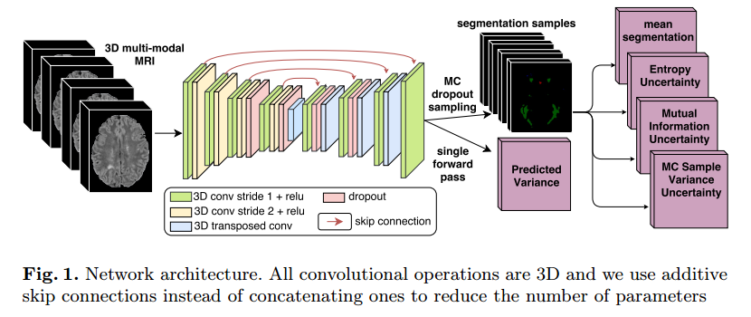
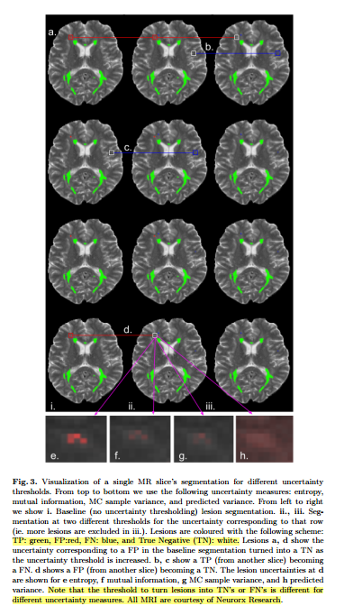

- [Uncertainty Theory and Applications](#uncertainty-theory-and-applications)
  - [Assessing Reliability and Challenges of Uncertainty Estimations for Medical Image Segmentation, MICCAI 2019, Paper](#assessing-reliability-and-challenges-of-uncertainty-estimations-for-medical-image-segmentation-miccai-2019-paper)
  - [Exploring Uncertainty Measures in Deep Networks for Multiple Sclerosis Lesion Detection and Segmentation, MICCAI, 2018, Paper](#exploring-uncertainty-measures-in-deep-networks-for-multiple-sclerosis-lesion-detection-and-segmentation-miccai-2018-paper)

## Uncertainty Theory and Applications

### Assessing Reliability and Challenges of Uncertainty Estimations for Medical Image Segmentation, MICCAI 2019, [Paper](https://arxiv.org/abs/1907.03338)

**Problem**
- despite improvements in accuracy, the robustness aspects of these systems call for significant improvements for a successful clinical integration of these technologies, where each data point corresponds to an individual patient
- This highlights the importance of having mechanisms to effectively monitor computer results in order to detect and react on system’s failures at the patient level
- This information in turn can be used to leverage the decision-making process of a user, as well as to enable time-effective corrections
of computer results by for instance, focusing on areas of high uncertainty.

*Different Levels of Uncertainty*
| Level                   | info                                                                                                                                                                                                                                                    |
| ----------------------- | ------------------------------------------------------------------------------------------------------------------------------------------------------------------------------------------------------------------------------------------------------- |
| Pixel (Volex) Level     | 1. provides a measure of uncertainty for the predicted class of each voxel  2. providing additional information to foster comprehensibility or as guidance for correction tasks                                                                      |
| Instance (Object) Level | application: reduce the false discovery rate of brain lesions and cells                                                                                                                                                                                 |
| Subject (Patient) Level | 1. informs us whether the segmentation task was successful (e.g., above a certain metric)  2. Having information about success or failure would be sufficient for many tasks, e.g., high-throughput analysis or selection of cases for expert review |

**Contribuction**
- Different approaches have been proposed to quantify uncertainties in deep
learning models. including:
    - Softmax Entropy
    - MC dropout
    - Aleatoric uncertainty
    - Ensembles
    - Auxiliary network
- we evaluated common uncertainty measures with respect to their reliability, their benefit, and limitations.
- we analyzed the requirements for uncertainties in medical image
segmentation and we make practical recommendations for their evaluation.

**Result and Conclusion**

- (Important) Results show that current uncertainty methods perform similarly and although they are well-calibrated at the dataset level, they tend to be miscalibrated at subject-level
- The results also revealed that methods based on MC dropout are heavily dependent on the influence of dropout on the segmentation performance
- From our experiments we can conclude that methods that aggregate voxel-wise uncertainty to provide subject-level estimations are not reliable enough to be used as a mechanism to detect failed segmentations.
-  The aleatoric method fails to produce uncertainty at the locations of segmentation errors (i.e., low U-E) and is therefore unable to improve segmentation results through corrections

**Limitation**
- First, although the experiments were performed on two typical and  distinctive datasets, they feature large structures to segment. The findings reported herein may differ for other datasets, *especially if these consists of very small structures to be segmented*
- Second, the assessment of the uncertainty is influenced by the segmentation
performance. Even though we succeeded in building similarly performing models,
their differences cannot be fully decoupled and neglected when analyzing the
uncertainty

### Exploring Uncertainty Measures in Deep Networks for Multiple Sclerosis Lesion Detection and Segmentation, MICCAI, 2018, [Paper](https://arxiv.org/abs/1808.01200v1)

**Background**
- (**Research Status 1**) DL methods typically produce predictors with deterministic outcomes. In contrast, traditional Bayesian machine learning provides not only a prediction, but also an uncertainty about it, through a probability density over outcomes.  
- (**Research Status 2**) While mathematically principled, traditional Bayesian approaches to DL have not been widely used in applications due to implementation challenges and excessive training times. Recently, Gal and Ghahramani [4] presented a simpler approach to uncertainty estimation for DL, by training a dropout network and taking Monte Carlo (MC) samples of the prediction using dropout at test time. This approach produces an approximation of the posterior of the network’s weights.

- (**Application Prospect**) uncertainty measures in the results of an automatic, DL detection or segmentation method provide clinicians or radiologists with information, mation permitting them to quickly assess whether to accept or reject lesions of
high uncertainty, for example, or further analyze uncertain lesion boundaries. This could facilitate the wider adoption of DL methods into clinical work-flows.

**Problem**

- DL methods typically produce predictors with **deterministic outcomes**. In contrast, traditional Bayesian machine learning provides not only a prediction, but also an uncertainty about it, through a probability density over outcomes.
- Uncertainty estimates for the predictions would permit subsequent revision by clinicians.

**Contribution**

- We present the first qualitative and quantitative comparison of the effectiveness of several different uncertainty measures derived from MC dropout in the context of DL for lesion segmentation and detection in medical images
- We develop a 3D MS lesion segmentation CNN, augmented to provide four voxel-based uncertainty measures based on MC dropout: predictive variance, MC sample variance, predictive entropy, and mutual information.
- Voxel-wise uncertainties are combined to estimate lesion-level uncertainties. 
- **Our results indicate that while bigger lesions have large voxel-based uncertainties primarily along the border, the smallest lesions have the highest lesion-level
detection errors, along with the highest uncertainty.**

**Method**

- The standard approach to generate a classification would be to compute the indicator function $1_{y_i \ge \theta}$ where the threshold $\theta$ is specified (eg. 0.9). When we use the uncertainty measure, we will additionally require that $U_m(i)$ is below another chosen threshold $\eta$ in order to produce the prediction.
- Suppose we can generate a large set of candidate lesions. For a candidate $l$, composed of voxels $p...q$, we will compute the lesionuncertainty $U_m(l)$ from the voxel-wise uncertainties as: 
$U_m(l) = \sum_{i=p}^{q}log(U_m(i))$.
-  we rescale the values $U_m(l)$ to $[0, 1]$, Detection is then performed using the uncertainty threshold and outputs in the same case as for the voxel-level.

**Results and Conclusion**
- In general, measures computed from stochastic dropout samples are more uncertain around lesion contours. 
- Despite these voxel-wise differences, when accumulating evidence to the lesion-level, the different measures tend to rank lesions is the same order of certainty, albeit on different scales, which leads to filtering out the same lesions, at different thresholds 
- We also note that small lesions are relatively more uncertain than medium and large lesions. This is a consequence of computing lesion uncertainty from the log sum of all the uncertainty values in a detected lesion area
- **Although large lesions have larger, more uncertain contours, the accumulation of lesion-evidence within the boundary provides an overwhelming certainty that there is a lesion there. This is not the case for small lesions (less evidence).**
-  Our results indicate that filtering based on uncertainty
greatly improves lesion detection accuracy for small lesions, which make up 40% of the dataset, indicating that high uncertainty does indeed reflect incorrect predictions

